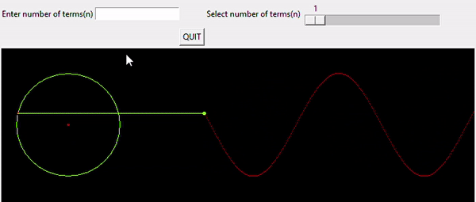

# Fouier-Series-Demo
A Python GUI tool built using Tkinter, for demonstrating the trigonometric Fourier trigonometric series for the square waves for "arbitarily" :blush: large values of n.
   
## Demo:tv:

## Contributing
Contributions are always welcome!

## References
* Fourier series 
    - https://en.wikipedia.org/wiki/Fourier_series
    - https://www.electrical4u.com/trigonometric-fourier-series/

### Todos

   - Increase number of functions
   - Numeric implementation
   - Add more types of waves
   - Add sound demo

License
----

MIT &copy; Gadri Ebenezer
